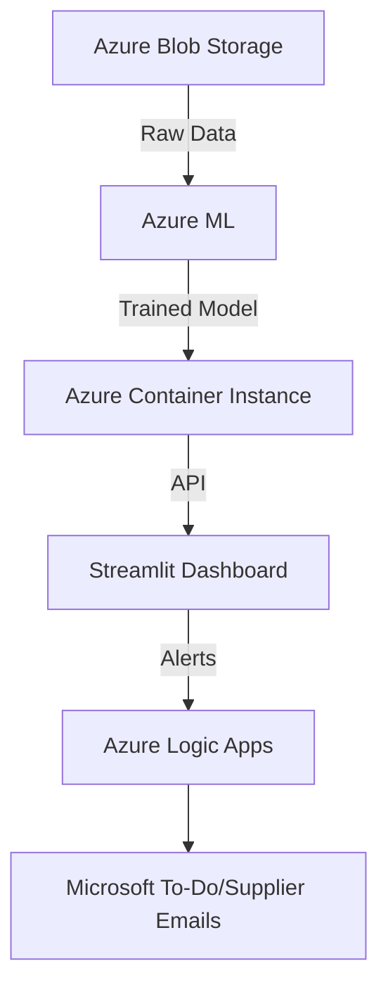

# Supply Chain Automation POC with Azure ML & Streamlit


A Proof of Concept (POC) for automating supply chain processes using **AI-driven demand forecasting**, **automated workflows**, and **real-time dashboards**. Built with Azure ML for predictions and Streamlit for visualization.

---

## 📌 Key Features
- **AI Demand Forecasting**: Predicts `demand_next_week` using Azure AutoML.
- **Automated Alerts**: Triggers reorders via Azure Logic Apps when inventory is low.
- **Supplier Risk Dashboard**: Tracks lead times and delay probabilities.
- **Global Inventory Tracking**: Real-time visibility across all countries.
- **Microsoft To-Do Integration**: Auto-assigns procurement tasks.

---

## 📊 Architecture


---
## 🚀 Quick Start
**1. Clone the Repository**
  ```
  git clone https://github.com/your-username/supply-chain-automation-poc.git
  cd supply-chain-automation-poc
```
**3. Install Dependencies**
  ```
  pip install -r requirements.txt
```
**4. Set Up Azure Resources**
```
  Create Azure ML Workspace (Guide).
  Upload Data to Blob Storage:
      - historical_sales.csv
      - inventory.csv
      - suppliers.csv
  Deploy AutoML Model (Use automl_training.ipynb).
  Configure Azure Logic Apps (Sample Workflow).
```
**5. Configure Environment Variables**
  * Create a .env file:
  ```
    AZURE_ML_ENDPOINT="http://your-azure-ml-endpoint.azurecontainer.io/score"
    AZURE_API_KEY="your-api-key"
    LOGIC_APP_URL="your-logic-app-trigger-url"
  ```
**6. Run the Streamlit Dashboard**
  ```
  streamlit run app.py
  📂 File Structure
  ├── data/                   # Synthetic datasets
  │   ├── historical_sales.csv
  │   ├── inventory.csv
  │   └── suppliers.csv
  ├── app.py                  # Streamlit dashboard
  ├── automl_training.ipynb   # Azure ML model training
  ├── requirements.txt        # Python dependencies
  └── .env.example            # Environment template
  ```

## 📈 Demo Screenshots
    - Inventory Overview
    - Supplier Risks
    - Inventory Suppliers
    
## 🛠️ Customer Pain Points Addressed**
  * Manual Ordering → AutoML Forecasting.
  
  * Stockouts → Real-Time Alerts.
  
  * Supplier Delays → Risk Dashboard.
  
  * Global Visibility → Country-Level Tracking.

## 📄 Presentation Slide Deck
A prebuilt slide deck for stakeholder demos is available in presentation/.
Key slides:

  * Problem Statement
  
  * Architecture Overview
  
  * ROI Metrics (40% fewer stockouts, 50% faster ordering)
  
  * Live Demo Walkthrough

## 🌐 Future Enhancements
  * Integrate with ERP systems (SAP/Oracle).
  
  * Add multi-region Azure deployment.
  
  * Use Azure Kubernetes Service (AKS) for scaling.
  
## 🤝 Contributing
```
  Fork the repository.
  
  Create a feature branch (git checkout -b feature/your-feature).
  
  Commit changes (git commit -m 'Add your feature').
  
  Push to the branch (git push origin feature/your-feature).
  
  Open a Pull Request.
```


---

### 📌 How to Use This README
1. Replace `your-username`, `your-azure-ml-endpoint`, and other placeholders.
2. Add screenshots to the `assets/` folder.
3. Customize the Logic Apps workflow in `.github/logic_apps`.
4. Update the slide deck in `presentation/` with your branding.
